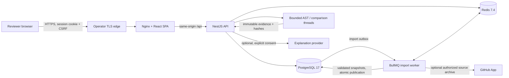

# Architecture

PostgreSQL is the durable source of truth for tenant scope, immutable snapshots, confirmed mappings, frozen comparison input/result and reviewer history. Redis supports import queues, authentication rate limits and optional AI budgets/cache. Queue jobs are recoverable from database outbox rows; imported code is parsed as data and never installed or executed. API comparisons run in bounded worker threads, rather than the legacy Redis analysis queue.

Frontend reads evidence through the API. Every scoped endpoint checks membership/permission; composite database foreign keys prevent cross-workspace attachments even when UUIDs are known. Opaque session cookies are HttpOnly; browser mutations send session-bound CSRF tokens and an allowed origin. User passwords use Argon2id. GitHub tokens are encrypted server-side. Explanation text cannot authorize a release: human decisions are appended against the exact SHA pair and result hash.

See the [ER diagram and integrity constraints](data-model.md) for entities and [methodology](methodology.md) for graph semantics. The diagram describes implemented paths; public hosting, multi-region operation and automatic deployment are future work.
