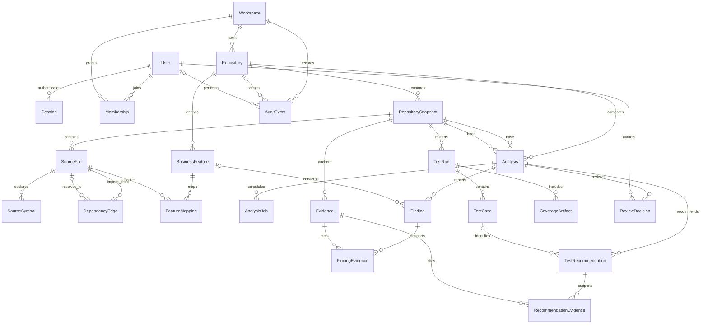

# Core data model

All repository-owned records carry `workspaceId` and `repositoryId`. Composite foreign keys bind those values to their parent records. A valid record ID from another workspace cannot be attached simply by supplying the current workspace ID. Users and sessions are global identities; membership is the authorization boundary.

## Identity, ownership, and immutable references

- User email is trimmed/lowercased before persistence, unique, and protected by a normalization CHECK. Passwords are Argon2id hashes; raw passwords are never persisted.
- Membership has composite primary key `(workspaceId, userId)`. A partial unique index permits at most one Owner per workspace. Registration atomically creates the workspace and Owner membership. Public APIs cannot remove/demote the Owner or promote another Owner; ownership transfer is deferred.
- A session has a unique SHA-256 token hash, a session-bound CSRF token, nullable user reference (anonymous login bootstrap), and an absolute expiration timestamp. Anonymous sessions are not authorized memberships.
- Repository uniqueness is `(workspaceId, owner, name)`; the metadata API normalizes owner/name to lowercase. Two tenants can independently register the same GitHub repository. Metadata registration is not GitHub authorization or import.
- A snapshot is unique by `(workspaceId, repositoryId, commitSha)`. Commit SHA CHECKs accept full lowercase 40- or 64-character hexadecimal identifiers, never branch names or abbreviated SHAs. This validates identifier shape; actual commit existence must be verified during the future authorized import phase.
- Snapshots cannot be updated. A new commit requires a new snapshot. Files, symbols, static dependency edges, explicit mappings, and test runs are anchored to snapshots; analysis base/head references must belong to the same workspace/repository.
- Evidence records carry their own `commitSha`. A four-column foreign key to the snapshot requires the exact snapshot ID, repository, workspace, and SHA to agree. Evidence records are immutable; content hashes describe imported content, not a claim of authenticity.
- Test cases and coverage artifacts inherit an immutable commit reference through their test run's snapshot. Coverage can be incomplete; the presence or absence of an artifact does not establish whether tests exist.
- Dependency edges can have no resolved target, retaining the import specifier and a limitation. Their source and any resolved target must belong to the same snapshot.
- A finding is either explicitly `SUGGESTION` or has at least one Evidence link. Existing-test recommendations require a TestCase and evidence; explicitly marked suggestions may lack them. Deferred constraint triggers enforce these requirements at transaction commit, including when the last link is removed.
- Review decisions append reviewer, outcome, timestamp, and comment to an analysis. They are review judgments, not confirmation that a feature is broken.
- Audit records contain action, actor, target, request ID, and tenant/repository scope, never passwords, session cookies, provider keys, or request bodies. UPDATE is rejected. There is no audit-edit API; administrative retention/purge is not implemented.

## Uniqueness and query indexes

| Entity                                   | Constraint/index                                                                      | Purpose                                                            |
| ---------------------------------------- | ------------------------------------------------------------------------------------- | ------------------------------------------------------------------ |
| User                                     | unique email                                                                          | Canonical account identity                                         |
| Session                                  | unique tokenHash; userId; expiresAt                                                   | Token lookup, user-session lookup, expired-session pruning         |
| Membership                               | workspaceId/userId PK; userId/workspaceId index; partial Owner index                  | Single membership, efficient workspace listing, at most one Owner  |
| Repository                               | workspaceId/owner/name; id/workspaceId                                                | Tenant-scoped identity and parent foreign keys                     |
| Snapshot                                 | workspaceId/repositoryId/commitSha; id/repositoryId/workspaceId, with and without SHA | Deduplicate immutable commits and anchor scoped references         |
| SourceFile                               | workspaceId/repositoryId/snapshotId/path                                              | One source path per snapshot                                       |
| SourceSymbol                             | scope + file/name/startLine/kind                                                      | Distinguish same-name declarations at different locations          |
| DependencyEdge                           | scope + source/specifier/line/kind; reverse target index                              | Deduplicate import evidence and support reverse dependency tracing |
| BusinessFeature                          | scope + key                                                                           | Stable feature identity per repository                             |
| FeatureMapping                           | scope + feature/snapshot/file                                                         | Deduplicate explicit mapping records                               |
| Analysis                                 | scope + createdAt                                                                     | Repository analysis history                                        |
| AnalysisJob                              | unique queueJobId; scope + analysis/status                                            | Queue idempotence and per-analysis job state                       |
| Finding                                  | scope + analysisId                                                                    | Retrieve findings without global scans                             |
| Evidence                                 | scope + snapshot/kind                                                                 | Retrieve evidence for a commit                                     |
| FindingEvidence / RecommendationEvidence | paired record IDs PK; scope + evidenceId                                              | Avoid duplicate citations and support reverse evidence lookup      |
| TestRun                                  | scope + snapshot/provider/externalRunId                                               | Idempotent import per commit and source                            |
| TestCase                                 | scope + run/identity                                                                  | Preserve distinct cases from each imported run                     |
| CoverageArtifact                         | scope + run/contentHash                                                               | Avoid duplicate artifacts without merging different runs           |
| TestRecommendation                       | scope + analysisId                                                                    | Retrieve recommendations for a release review                      |
| ReviewDecision                           | scope + analysis/createdAt                                                            | Review history                                                     |
| AuditEvent                               | workspace/createdAt; scope/createdAt                                                  | Tenant and repository audit timelines                              |

Here, “scope” means `workspaceId, repositoryId`, plus `snapshotId` for file/symbol/edge identity. Scoped parent keys also support the composite foreign keys. Referential checks marked NO ACTION are deferred to transaction commit so an entire owned graph can be deleted atomically without cascade-order failures; invalid cross-scope links still cannot commit. Deletion endpoints for these graphs are not exposed.

## Migration notes

Phase 2 includes additive core tables, integrity constraints/triggers, and a follow-up migration for deferred restrictive foreign keys. The Phase 1 Repository table was intentionally empty and had no write endpoint. Migration explicitly refuses to assign manually inserted unscoped legacy repositories to an arbitrary tenant; back up such records and define their ownership before proceeding. It does not delete or auto-reassign them.

Use migrations, not `prisma db push`: partial indexes, immutability triggers, and deferred evidence constraints live in SQL and are not fully representable in Prisma's schema language. Do not edit applied migrations.

This phase exposes account/workspace/member management, repository metadata registration, feature records/mappings, and draft analyses. Snapshot import, analyzer execution, evidence/test ingestion, recommendation generation, review-decision endpoints, and GitHub integration connections remain future work. No imported code is executed.
